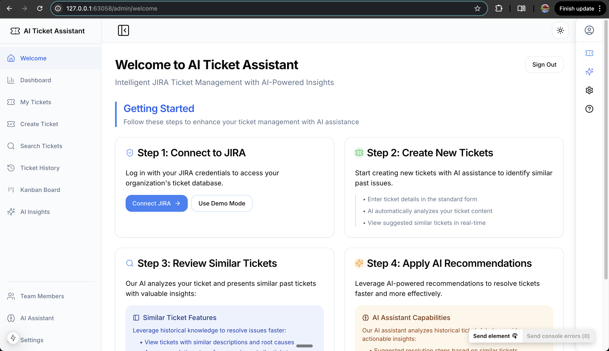
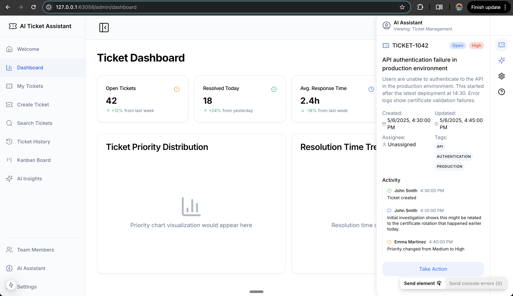
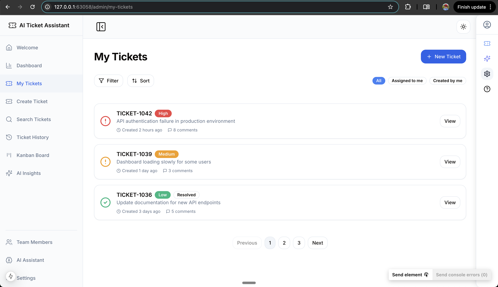
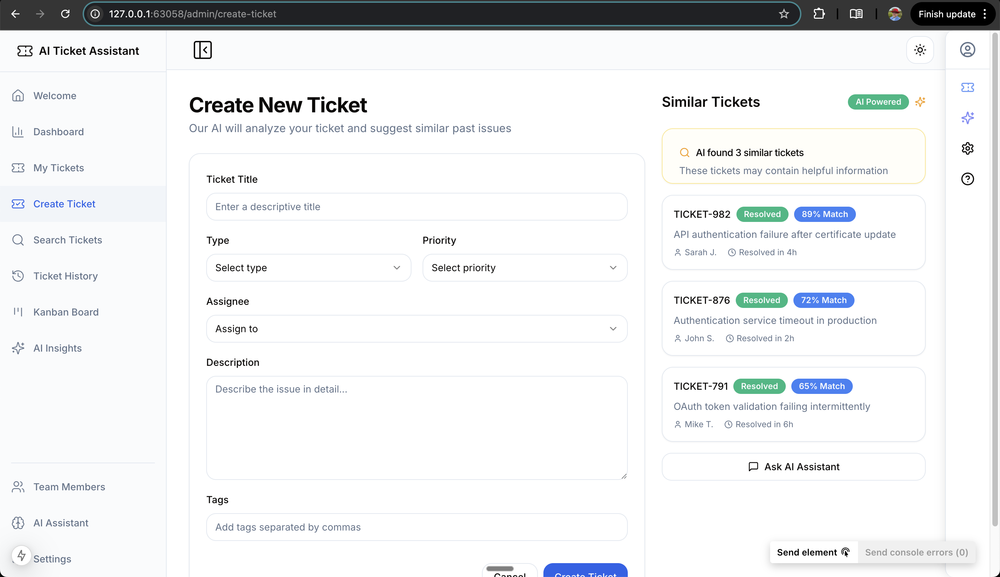
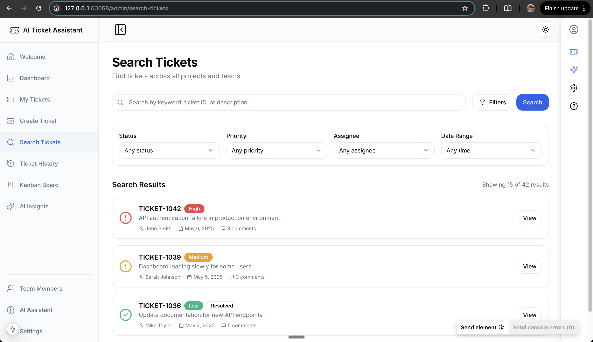
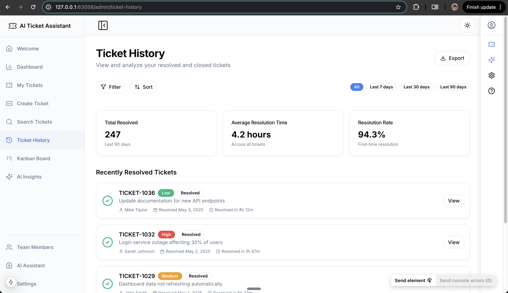
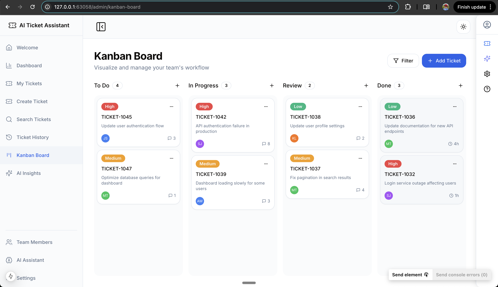
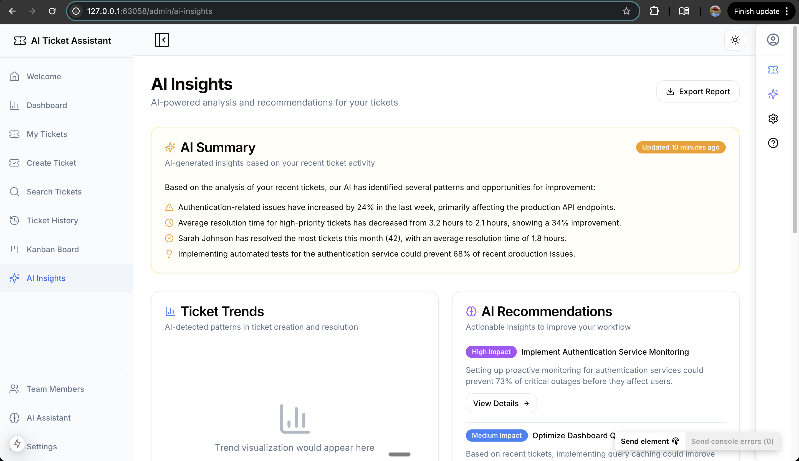
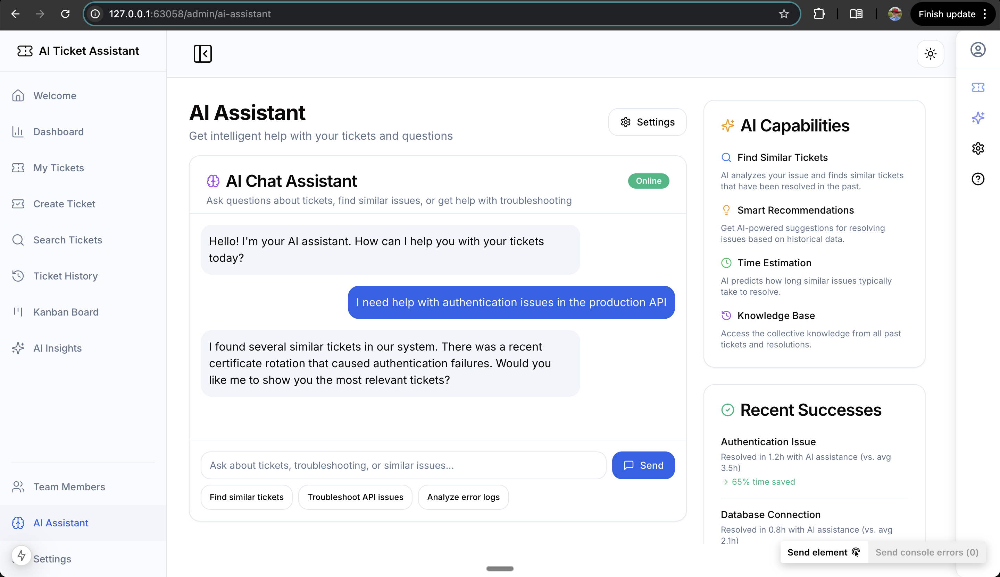

# AI Ticket Assistant Screenshots

## Welcome Page
The welcome page introduces users to the AI Ticket Assistant platform with a step-by-step guide on connecting to JIRA, creating tickets with AI assistance, reviewing similar tickets, and applying AI recommendations.

## Dashboard
The ticket dashboard provides an overview of all tickets with key metrics and statistics. The right sidebar shows the AI assistant that can provide insights about tickets and answer questions.

## My Tickets View
This view shows all tickets assigned to the logged-in user, with AI-powered insights about ticket priority, estimated resolution time, and similar past tickets.

## Create Ticket
The ticket creation interface allows users to create new tickets while the AI assistant automatically identifies similar past issues, helping to reduce duplicate tickets and providing resolution suggestions based on historical data.

Ticket search capabilities with integration with the AIS. 

Ticket history integrated with the AI assistant. 

Can Ben board with AI integration assistant

The AI assistant page. 

The AI assistant standalone integration page. 

